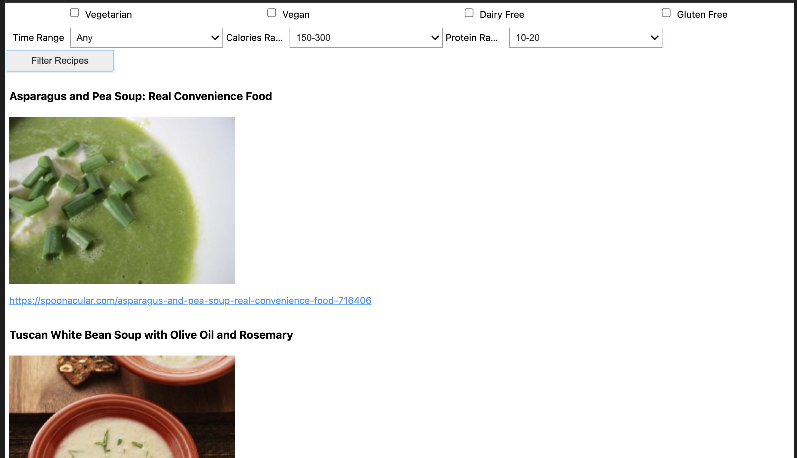

# PROJECT API

---

  

---

## OBJETIVOS

En este  proyecto, podrás conocer todo el proceso de creación de un  widget basado en la API de Spoonacular. Esta API cuenta con una enorme base de datos de miles de recetas, y nuestro widget ayudará al usuario a encontrar la receta perfecta según sus necesidades y preferencias nutricionales. https://spoonacular.com/food-api.

  

---

## PROCESO

### API REQUEST

- El primer paso del proceso fue hacer una request a la API de Spoonacular para sacar una base de datos de 100 recetas (el limite de una request gratuita) y su conversión a un Dataframe de Pandas para su tratamiento.

### CLEANING DEL DATASET

- El siguiente paso fue hacer una limpieza del dataset y la creación de nuevas columnas para ajustarlo a nuestras necesidades y ayudarnos a cumplir nuestro objetivo.
  
### CREACIÓN DEL WIDGET

  

- El paso final se basó en crear el codigo necesario para filtrar el data set según las preferencias del usuario y la creación del widget que le permetiría seleccionarlas.
   
- Los usuarios podrán filtrar las recetas según las siguientes caracteristicas:
  
  - Si es apto para vegetarianos.
  - Si es apto para veganos.
  - Si es apto para celíacos.
  - Si es apto para intolerantes a la lactosa.
  - El aporte calórico del plato.
  - El contenido proteico.

---

## RESULTADOS

  

---

